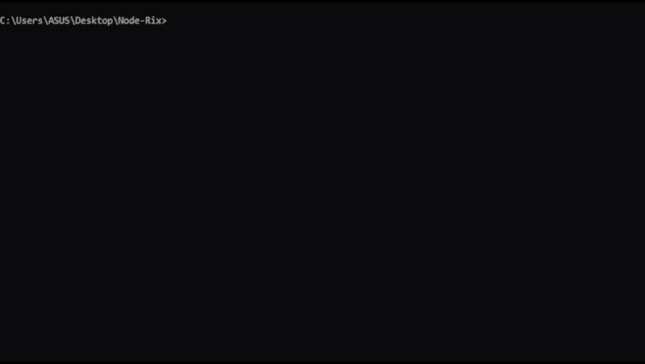

# Node-Rix

A cool Matrix digital rain terminal simulator for Node.js. Perfect for devs who want to show off their setup or just feel like Neo while coding!

A lightweight tool for creators who want to make their visual/video content look more polished.



## ✨ Features
- Matrix-style binary rain animation
- Runs directly in the terminal
- Modular and clean project structure
- Minimal dependencies

## 📦 Installation
You can install and run Node-Rix in two common ways:

### 1) Install from GitHub (development / testing)
```bash
git clone https://github.com/Mohammad-Khiabani/node-rix.git
cd node-rix
npm install
npm start
```

> `npm start` runs the demo script included in this repo. Use this while developing or testing locally.

### 2) Install globally from npm (once published)
```bash
npm install -g node-rix
node-rix
```

## 🧠 Usage
Run the tool:

```bash
# Run via npm start (if installed from GitHub)
npm start

# Or run global CLI (if installed globally)
node-rix
```

## 🗺 Roadmap
- [ ] Add adjustable animation speed (e.g. `node-rix --speed 30`)  
- [ ] Add selectable custom colors (interactive selection)  
- [ ] Add random color cycling (dynamic colorful mode)  
- [ ] Add realistic rain physics mode (natural falling behavior)


## 🤝 Contributing
Pull requests and suggestions are welcome!

## 📄 License
MIT
